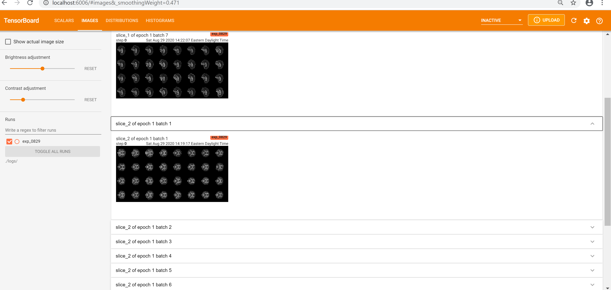
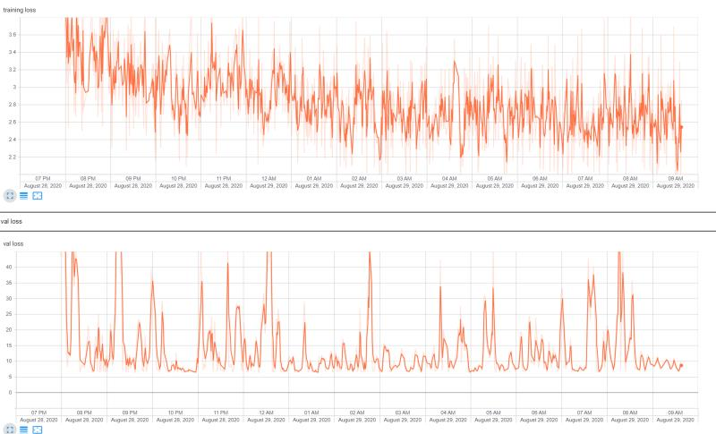
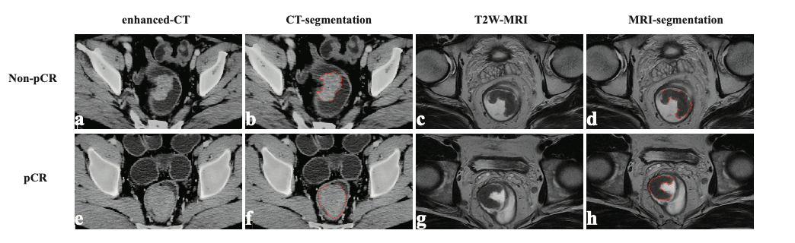
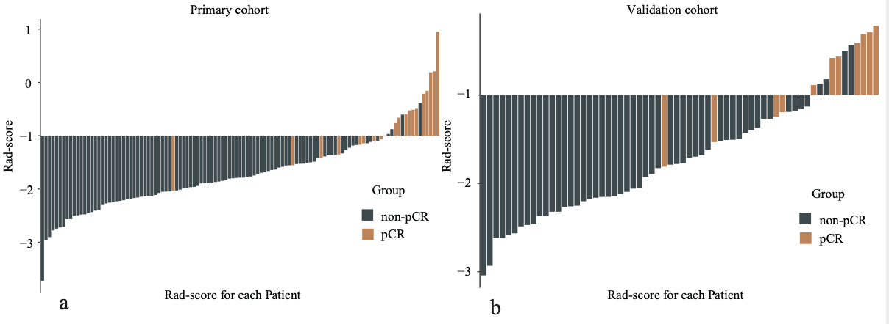

[[CV]](./LIU, ZONGCHAO_11:02:2020.pdf)

# About 

I received a BS in Preventive Medicine from Shandong University in 2019 and currently study biostatistics in Mailman School of Public Health, Columbia University. I am passionate about the field of biomedical engineering, epidemiology and health data science. I am also preparing for applying to doctoral programs in epidemiology and biostats. The following are some of the research projects that I have been working on:

**A Big Project for transformation between ICD-10-CM code and Clinical Classification Categories, Excessive Morbidity Assessment, as well as Cluster Analysis**

[Click to see updated report](./Comorbidity.html)

**Controlling FDR: A 3D-based interpretable deep learning framework for diffusion tensor brain imaging data**

https://github.com/zl2860/3d-CNN-DTI

**Radiomics analysis of computed tomography for predicting pathological response to neoadjuvant treatment in rectal cancer: Post-hoc Analysis of a Randomized Controlled Trial**

https://github.com/zl2860/radiomics-R

# Contact

Zongchao Liu  
100 Haven AVE APT TOWER 3  
New York, New York 10032  
E-mail: zl2860@cumc.columbia.edu  
Phone: 1-646-249-6941